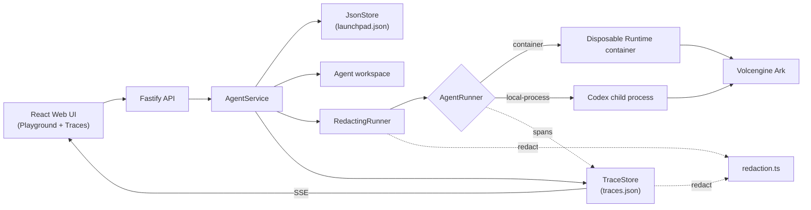

# Agent Run Audit & Redaction Middleware

Live demo video at https://youtu.be/04soBmrA6i4

A **trace, audit, and secret-redaction middleware** for an Agent platform.

The base platform (from the hackathon Starter Kit) is a single-node control
plane: Agent CRUD, a browser Playground, persistent workspaces, and Codex CLI
turns backed by the Volcengine Ark Responses API. This repo adds middleware for
the **Glass Box** track: every Agent Run is recorded as a diagnosable trace, and
no credential is allowed into any stored or displayed artifact.

> Single-user proof of concept. No per-user authorization, no hardened
> multi-tenant sandbox. Do not use production data or credentials.
> See [SECURITY.md](SECURITY.md).

## The middleware

### Problem

The platform runs untrusted model output as shell commands in a workspace. Two
gaps, both of which have to be closed in the backend / runtime path, not the UI:

1. **A Run is a black box.** A failed task yields one error string — no view of
   which step broke, what command ran, or how long it took.
2. **Secrets leak into every artifact.** The Agent reads API keys from its
   environment and from files, then echoes them into chat replies, error
   messages, trace records, and server logs. A screenshot or a shared log file
   becomes a credential leak.

### Design

Two layers over the platform's existing `AgentRunner` seam, sharing one
detection engine.

| Layer | Files | Role |
| --- | --- | --- |
| Redaction engine | `redaction.ts` | Pure function. Detects vendor API keys, JWTs, private keys, URL credentials, `password` / `token` / `secret` assignments, and the deployment's literal `ARK_API_KEY` / `APP_AUTH_TOKEN`. Returns scrubbed text plus a per-match list of `{rule, length}` — never the value; callers roll this up into a `{rule, count}` summary. |
| Runner middleware | `redacting-runner.ts`, `runner-factory.ts` | `RedactingRunner` decorates whichever runner is active (local process or container). Scrubs the agent message and the error message before either is stored or returned; persists a per-Run `redactions` summary, shown as a notice in the Playground. |
| Trace / audit | `trace-store.ts`, `trace-recorder.ts`, `trace-types.ts`, `TracesView.tsx` | Every Run becomes a Trace — a tree of categorized Spans (orchestration, model_call, tool_call, sandbox_execution, workspace_operation, policy_decision) with status, duration, and error. Live-streamed over SSE to a Traces tab. |

Rationale:

- **Decorator, not a fork** — one `RedactingRunner` covers both runtime
  profiles with no duplication.
- **Redact before storage, not before display** — a secret on disk has already
  leaked. `TraceStore` runs every span `input`, `output`, `error`, and
  `metadata` field through the engine before writing `traces.json`, and the
  Fastify error handler scrubs error messages and stack traces the same way.
  Every downstream reader (API, UI, export, log) is then safe by construction.
- **Fail closed** — ambiguous matches are redacted; a small placeholder
  allowlist (`<your-key>`, `${VAR}`, `changeme`) suppresses obvious false
  positives.

### Trace features

- **A real guardrail, not just a log** — every prompt is checked against a
  20,000-character policy limit *before* it reaches the Runtime, recorded as a
  `policy_decision` span. A blocked Run never invokes Codex.
- **Accurate pass/fail** — a failing shell command, a failed file edit, or a
  Codex `turn.failed` each show up as a failed span with the real error, not a
  silently "completed" one.
- **Tree and Timeline views**, each filterable by span category.
- **Jump to failing step** — auto-expands, highlights, and scrolls to the first
  failed span.
- **Retry chains** — retrying a failed / cancelled Run links the attempts
  (`attempt` count, bidirectional breadcrumbs); retrying a Run that didn't fail
  is rejected.
- **Live, not polled** — Run list and trace detail both stream over SSE.
- **Export** — any trace downloads as JSON.

API: `GET /api/traces`, `/api/traces/:id`, `/api/traces/:id/export`,
`/api/traces/stream`, `/api/traces/:id/stream`, `/api/runs/:id/trace`. Data
model and sequence diagram in
[docs/ARCHITECTURE.md](docs/ARCHITECTURE.md#trace-and-audit-middleware).

## Run it

Requirements: Node.js 22+, npm 10+, one of Docker / Colima / Podman, and a
Volcengine Ark API key plus a Responses-capable endpoint. Codex CLI ships in
the Runtime image.

```bash
ARK_API_KEY=your-ark-api-key \
ARK_MODEL=ep-your-endpoint-id \
npm run poc
```

The first run installs dependencies and builds the Runtime image, then serves
<http://localhost:3000>. `Ctrl+C` stops it and keeps Agent workspaces and
conversations.

Dev mode (host Codex process, hot reload):

```bash
npm install
cp .env.example .env
npm install --global @openai/codex@0.111.0
npm run dev            # Web UI :5173, API :3000
```

Docker Compose: `./scripts/bootstrap-local.sh`, then `docker compose up --build`.
ECS / Terraform paths: [docs/DEPLOYMENT.md](docs/DEPLOYMENT.md).

### Configuration

| Variable | Default | Purpose |
| --- | --- | --- |
| `ARK_API_KEY` | required | Ark model API key. |
| `ARK_MODEL` | required | Responses-capable endpoint or model ID. |
| `APP_AUTH_TOKEN` | empty on loopback | Shared demo token; 24+ random chars when remote. |
| `REDACT_SECRETS` | `true` | Scrub credentials from the agent message and error before they are stored or returned. Set `false` only to demonstrate the before / after in the Playground — traces and API errors are redacted regardless. |

Full option list in [.env.example](.env.example).

## How it works



`RedactingRunner` scrubs the agent message and errors; `TraceStore` runs every
span field through the same `redaction.ts` before writing `traces.json`. The
first turn uses `codex exec`; later turns resume the stored Codex thread.

## Tests

```bash
npm test        # server suite (vitest)
npm run check   # typecheck + test + build
```

| File | Covers |
| --- | --- |
| `redaction.test.ts` | each detection rule, placeholder guard, idempotency |
| `redaction.corpus.test.ts` | ~30 real secret formats must redact; false-positive corpus (git SHAs, UUIDs, lockfile hashes, prose) must not |
| `redacting-runner.test.ts` | output + error scrubbing, per-Run summary, cancellation passthrough, end-to-end via `AgentService` |
| `trace-store.test.ts` | span `input` / `output` / `error` / `metadata` redacted before persistence; span tree, retry chains, SSE |

## Limitations

- **Workspace files are not rewritten.** A key the Agent writes into
  `config.json` stays on disk — redaction guards the return channel (chat,
  errors, traces, logs), not workspace contents.
- **Pattern-based.** A bare high-entropy secret with no recognizable prefix and
  no `key=` / `token:` context is not caught; tracked under "known gaps" in
  `redaction.corpus.test.ts`.
- **Placeholder allowlist is English-oriented.**
- Inherits the platform's limits: single user, single process, no per-user
  authorization, ordinary (not hardened) container isolation.

## No secrets

No credential appears in source, the server log, `traces.json`, API responses,
the browser, or a screenshot:

- `.env` is git-ignored; `.env.example` ships placeholders only.
- `RedactingRunner` scrubs chat and error output; `TraceStore` scrubs every
  span field; the error handler scrubs messages and stack traces.
- The `redactions` summary and the `secret.redacted` log line carry rule names
  and counts only — never the value.
- Verify: after a run, grep the trace export or `traces.json` for the key used
  — no match.

## Docs

- [Architecture](docs/ARCHITECTURE.md)
- [Local POC](docs/LOCAL_POC.md)
- [Deployment](docs/DEPLOYMENT.md)
- [Hackathon extension guide](docs/HACKATHON_EXTENSION_GUIDE.md)
- [Security policy](SECURITY.md)

## License

[MIT](LICENSE)
