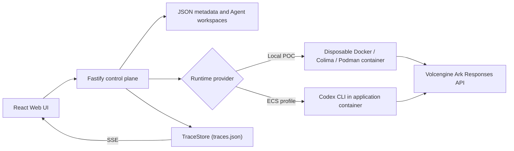

# Volc Agent Launchpad

A minimal Agent platform for three-day middleware hackathons. It provides Agent
CRUD, a browser Playground, persistent workspaces, and Codex CLI backed by the
Volcengine Ark Responses API.

Run it locally with Docker, Colima, or rootless Podman, or deploy it to
Volcengine ECS.

> [!WARNING]
> This is a single-user proof of concept. It intentionally has no identity or
> per-user authorization, and no hardened multi-tenant sandbox. It does now
> include a trace/audit middleware layer (see below) - do not use production
> data or credentials regardless. See [SECURITY.md](SECURITY.md).

## Screenshots

### Agent Playground


### Create an Agent


## Features

- React and TypeScript Web UI
- Agent create, edit, start, stop, delete, and multi-turn chat
- Fastify control plane with asynchronous Run state
- Persistent Agent workspaces and Codex sessions
- Disposable Docker, Colima, or Podman container for each local turn
- Docker and Terraform deployment paths for Volcengine ECS
- **Trace and audit middleware**: every Run is recorded as a Trace of
  categorized, redacted Spans, live-streamed to a Traces tab with tree and
  timeline views, a prompt-length policy guardrail, retry chains, and
  per-category filtering. See [Trace and audit middleware](#trace-and-audit-middleware) below.

## Requirements

- Node.js 22+
- npm 10+
- Docker, Colima, or Podman
- A Volcengine Ark API key and endpoint that supports the Responses API

Codex CLI is included in the Runtime image and is not required on the host.

## Local browser SOP

### 1. Check the local tools

Install Node.js 22+ and one supported container engine, then verify them:

```bash
node --version
npm --version
docker --version        # Docker Desktop, Docker Engine, or Colima
podman --version        # Use this instead when running Podman
```

Only one container engine is required. Codex CLI is already included in the
Runtime image.

### 2. Clone the repository

```bash
git clone <repository-url> volc-agent-launchpad
cd volc-agent-launchpad
```

Skip this step when already working from the repository root.

### 3. Start the POC

```bash
ARK_API_KEY=your-ark-api-key \
ARK_MODEL=ep-your-endpoint-id \
npm run poc
```

The first run installs Node.js dependencies and builds the Runtime image. The
script automatically selects Docker, Colima, or Podman.

### 4. Open the browser

Visit <http://localhost:3000>, or open it from the terminal:

```bash
open http://localhost:3000       # macOS
xdg-open http://localhost:3000   # Linux desktop
```

In the Web UI:

1. Select **Create Agent**.
2. Enter a name, description, and workspace instructions.
3. Select **Create Agent** again.
4. Enter a task in the Playground, for example:

   ```text
   Create a TypeScript hello-world CLI, add a test, and run it.
   ```

The Agent can write files, run commands, and continue the same Codex session in
later messages.

### 5. Stop and resume

Press `Ctrl+C` in the startup terminal. The script removes temporary Runtime
containers but keeps Agent workspaces and conversations.

- macOS state: `~/.volc-agent-launchpad/`
- Linux state: `.local/`
- Custom location: set `LOCAL_POC_DATA_ROOT`

Run the same `npm run poc` command to continue later.

### Select a specific container engine

Force Podman when multiple engines are installed:

```bash
CONTAINER_ENGINE=podman \
ARK_API_KEY=your-ark-api-key \
ARK_MODEL=ep-your-endpoint-id \
npm run poc
```

Colima uses `CONTAINER_ENGINE=docker` because it exposes the Docker CLI.

For a clean Linux host, follow the
[rootless Podman setup](docs/LOCAL_POC.md#rootless-podman-on-linux).

## Docker Compose

Create and edit the configuration:

```bash
./scripts/bootstrap-local.sh
```

Required values in `.env`:

```dotenv
ARK_API_KEY=your-ark-api-key
ARK_MODEL=ep-your-endpoint-id
APP_AUTH_TOKEN=replace-with-at-least-24-random-characters
```

Start the application:

```bash
docker compose up --build
```

Open <http://localhost:3000>. Stop it without deleting Agent data:

```bash
docker compose down
```

## Development

```bash
npm install
cp .env.example .env
npm install --global @openai/codex@0.111.0
npm run dev
```

- Web UI: <http://localhost:5173>
- API: <http://localhost:3000>

Use local paths in `.env` when running outside Docker:

```dotenv
APP_DATA_DIR=.data
AGENT_WORKSPACE_ROOT=workspaces
CODEX_HOME=codex-home
```

## Deployment

- [Existing Linux ECS with Docker](docs/DEPLOYMENT.md#existing-linux-ecs)
- [Complete Volcengine environment with Terraform](docs/DEPLOYMENT.md#terraform-deployment)
- [Local Docker, Colima, and Podman details](docs/LOCAL_POC.md)

The existing-ECS script deploys from the current source tree:

```bash
cp .env.example .env.production
./scripts/deploy-existing-ecs.sh .env.production
```

The Terraform path provisions VPC, subnet, security group, ECS, and EIP:

```bash
cp deploy/volcengine/terraform.tfvars.example \
  deploy/volcengine/terraform.tfvars
./scripts/deploy-volcengine.sh
```

## Configuration

| Variable | Default | Purpose |
| --- | --- | --- |
| `ARK_API_KEY` | Required | Ark model API key. |
| `ARK_MODEL` | Required | Responses-capable endpoint or model ID. |
| `ARK_BASE_URL` | Beijing v3 endpoint | Ark OpenAI-compatible API URL. |
| `APP_AUTH_TOKEN` | Empty on loopback | Shared demo token; use 24+ random characters remotely. |
| `REDACT_SECRETS` | `true` | Scrub credentials from Agent output and errors before they are stored. |
| `RUNTIME_PROVIDER` | `local-process` | `container` for disposable local Runtime containers. |
| `CODEX_SANDBOX_MODE` | `workspace-write` | Codex inner sandbox mode. |
| `CODEX_TIMEOUT_MS` | `600000` | Maximum duration of one turn. |
| `LOCAL_POC_DATA_ROOT` | Platform-specific | Local metadata, workspace, and session directory. |

See [.env.example](.env.example) for all Runtime and resource-limit options.

## How it works



The first turn uses `codex exec`; later turns resume the stored Codex thread.
Deleting an Agent archives its workspace under `workspaces/.deleted/`.

See [docs/ARCHITECTURE.md](docs/ARCHITECTURE.md) for component and extension
boundaries.

## Trace and audit middleware

Every Agent Run is recorded as a **Trace**: a tree of categorized, redacted
**Spans** covering orchestration, model calls, tool calls, sandbox execution,
workspace edits, and an automated policy check - viewable live in the
**Traces** tab next to Playground.

### What it does

- **A real guardrail, not just a log.** Every prompt is checked against a
  20,000-character policy limit *before* it reaches the Runtime, recorded as
  a `policy_decision` span. A blocked Run never invokes Codex.
- **Accurate pass/fail, not just "the event parsed."** A failing shell
  command, a failed file edit, or a Codex `turn.failed` all show up as a
  failed span with the real error - not a silently "completed" one.
- **Two ways to read a Run**: an expandable **Tree** (parent/child spans) and
  a **Timeline** (waterfall bars on a shared time axis), each filterable by
  span category.
- **Jump to failing step** auto-expands, highlights, and scrolls to the
  first failed span in a Run.
- **Retry chains**: retrying a failed or cancelled Run links the new attempt
  back to the one it retries (`attempt` count, bidirectional breadcrumbs).
  Retrying a Run that didn't actually fail is rejected.
- **Live, not polled.** The Run list and trace detail both stream over
  Server-Sent Events.
- **Redaction before storage.** Secrets are stripped and long payloads
  truncated before anything is written to disk, not just before display.
- **Export.** Any trace can be downloaded as JSON for offline inspection.

### Try it

1. Send a normal prompt from the Playground, then open the **Traces** tab and
   select the Run to watch its spans populate.
2. Trigger the policy guardrail: send a prompt of 20,000+ characters and
   watch it get blocked before the Runtime ever runs.
3. Ask the Agent to run something that will fail (e.g. a failing test) and
   use **Jump to failing step** to locate the exact failed span.
4. On a failed Run, click **Retry** (available in both the Playground error
   card and the Traces detail panel) and see the attempt chain link the two
   Runs together.
5. Use the category filter chips above the span tree/timeline to isolate,
   for example, just the `tool_call` spans in a busy Run.

See [docs/ARCHITECTURE.md](docs/ARCHITECTURE.md#trace-and-audit-middleware)
for the data model, sequence diagram, and API surface
(`GET /api/traces`, `GET /api/traces/:id`, `GET /api/traces/:id/export`,
`GET /api/traces/stream`, `GET /api/traces/:id/stream`).

## Validation

```bash
npm run check
terraform fmt -check -recursive deploy/volcengine
docker compose config
```

## Documentation

- [Architecture](docs/ARCHITECTURE.md)
- [Local POC](docs/LOCAL_POC.md)
- [Deployment](docs/DEPLOYMENT.md)
- [Hackathon extension guide](docs/HACKATHON_EXTENSION_GUIDE.md)
- [Security policy](SECURITY.md)
- [Contributing](CONTRIBUTING.md)

## License

[MIT](LICENSE)
