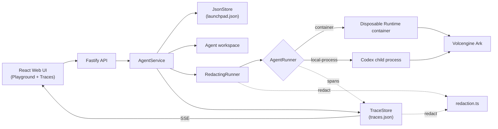
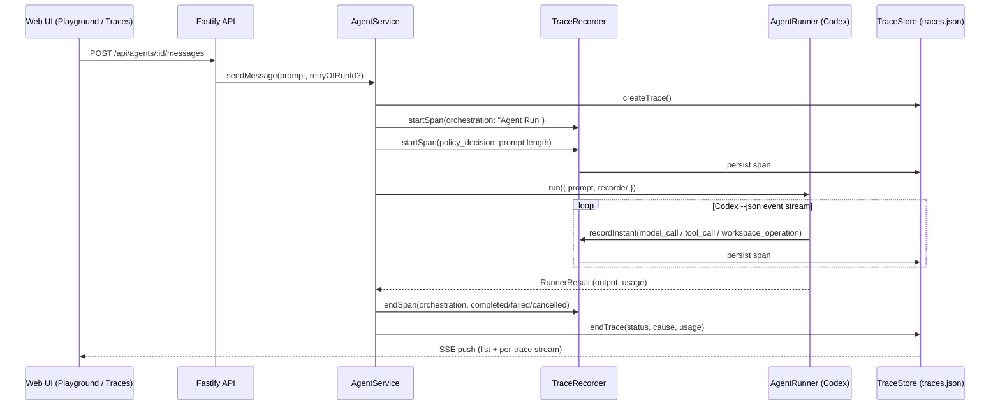

# Architecture

Volc Agent Launchpad is a single-node control plane for hackathon use.



## Components

### Web UI

Lists Agents, manages lifecycle actions, submits prompts, and polls asynchronous
Runs. It never receives the Ark API key. A second view, the Traces tab, is a
read path over the trace/audit middleware described below.

### Fastify API

Validates requests, protects remote demos with a shared bearer token, and
serves the compiled Web UI. The token is not user identity or authorization.

### AgentService

Coordinates lifecycle state, persistence, workspaces, and Runs. One Agent can
have only one active Run.

```text
ready -> busy -> ready
  |       |
  v       v
stopped  error
```

Interrupted Runs become `cancelled` after a restart.

### Storage

```text
data/launchpad.json       Agent, message, and Run metadata
data/traces.json          Trace and span audit records
workspaces/AgentID/       Agent-created files
workspaces/.deleted/      Archived deleted workspaces
codex-home/               Codex configuration and sessions
```

`JsonStore` and `TraceStore` each serialize writes and atomically replace one
JSON file. Both support one process only. They are kept as separate files so
a busy Run's span writes never contend with Agent/Run persistence.

### Runtime providers

- `CodexRunner` runs Codex inside the application container for ECS.
- `ContainerCodexRunner` starts one disposable Docker, Colima, or Podman
  container for every local turn.

Both providers use argv-only process execution, bound output and time, resume
the stored Codex thread, and escalate termination after a grace period. Both
also accept an optional `TraceRecorder`, so the same instrumentation covers
whichever provider is active.

### Redaction middleware

`RedactingRunner` decorates the active `AgentRunner`. Before an agent message
or error message reaches the store or the API, it replaces anything matching a
credential shape (vendor API keys, tokens, passwords, private keys, the
configured `ARK_API_KEY`) with `[REDACTED]`.

Each turn records a `redactions: { scope, rule, count }[]` summary on its
`AgentRun` — never the secret value — which the API returns and the Web UI
shows as a notice under the response. A `RedactionSink` callback also fires per
event for audit logging. Disable with `REDACT_SECRETS=false`.

## Deployment profiles

| Profile           | Control plane          | Agent execution                     |
| ------------------ | ----------------------- | ------------------------------------ |
| Local POC         | Host Node.js           | Disposable local container          |
| ECS               | Application container  | Codex process in the same container |
| Local development | Host Node.js           | Host Codex process                  |

## Trace and audit middleware

Every Agent Run is wrapped in a **Trace**: a tree of **Spans** that turns "the
Agent did something" into a reconstructable sequence of what it did, when,
and why it ended the way it did.



### Data model

- **Trace** - `id`, `agentId`, `agentVersion`, `runId`, `sessionId`
  (Codex thread), `actorType`, `status`, `cause`, `retryOfTraceId`,
  `retriedByTraceId`, `attempt`, timing, token `usage`, and its `spans`.
- **Span** - `id`, `traceId`, `parentSpanId`, `name`, `category`, `status`,
  timing, and redacted `input` / `output` / `error` / `metadata`.
- **Span categories**: `orchestration`, `model_call`, `tool_call`,
  `sandbox_execution`, `workspace_operation`, `policy_decision`.
- **Trace causes**: `completed`, `user_requested_stop`, `policy_blocked`,
  `runtime_error` - lets the UI distinguish "the user stopped it" from
  "it broke" from "an automated guardrail blocked it," without inspecting
  free-text error strings.

### Where spans come from

| Source | Span category | Notes |
| --- | --- | --- |
| `AgentService.executeRun` | `orchestration` | One root span per Run. |
| Prompt-length guardrail | `policy_decision` | Runs before the Runtime is ever invoked; a real pass/fail check, not just a type. |
| `codex-runner.ts` / `container-codex-runner.ts` | `sandbox_execution` | Wraps the whole `codex exec` process (local or containerized). |
| Codex `item.completed` events | `model_call` / `tool_call` / `workspace_operation` | Category and pass/fail status derived from the item's own `type`, `status`, and `exit_code` fields - a failing shell command is a failed span, not a silently "completed" one. |
| Codex `turn.failed` / `error` events | `model_call` / `orchestration` | Transient stream notices (e.g. `"Reconnecting..."`) are filtered out so they don't falsely flag a span as failed. |

### Redaction

`redactAndSummarize` and `redactDeep` run every span `input`, `output`,
`error`, and `metadata` field through the same detection engine as the
`RedactingRunner` middleware (`redaction.ts` - vendor key shapes, JWTs, private
keys, URL credentials, `password` / `token` / `secret` assignments, and the
deployment's literal `ARK_API_KEY` / `APP_AUTH_TOKEN`), then hard-truncate long
payloads. This happens **before** anything is written to `traces.json`, not
just before display. The Fastify error handler scrubs error messages and stack
traces the same way.

### Retry chains

A Run's `AgentRun.traceId` links it to its Trace. Retrying a **failed or
cancelled** Run (`sendMessage(..., { retryOfRunId })`) creates a new Trace
with `retryOfTraceId` pointing at the one it retries and `attempt`
incremented. `retriedByTraceId` (the forward link) is computed server-side
from the whole store on every read, not from any client-side filtered list -
so a retry stays discoverable from the original failed Trace even if the
UI's current status filter would otherwise hide the successful retry.

Retrying a Run that didn't actually fail is rejected (`400`), so `attempt`
counts stay meaningful for audit purposes.

### Live updates

`GET /api/traces/stream` and `GET /api/traces/:id/stream` are Server-Sent
Event endpoints. `TraceStore` exposes an `onChange` hook fired after every
successful mutation; the SSE routes push a fresh payload whenever it fires
(plus a slow interval as a safety net), so the Traces UI never polls.

### Traces UI

A Run list (status-filterable, scoped to one Agent or all) and a trace detail
view with **Tree** and **Timeline** (waterfall) modes, per-category filter
chips, a "jump to failing step" control that expands/highlights/scrolls to
the first failed span, retry chain breadcrumbs (backward and forward), and a
JSON export of the full trace.

## Extension seams

| Track       | Primary seam                            | Status                                                                                                                          |
| ----------- | ---------------------------------------- | -------------------------------------------------------------------------------------------------------------------------------- |
| Glass Box   | `RedactingRunner`, `TraceStore`, `redaction.ts` | **Implemented.** Trace/audit middleware plus secret redaction across output, errors, spans, and logs. See "Trace and audit middleware" and "Redaction middleware" above. |
| Bouncer     | API routes, Agent ownership             | Not implemented - no identity or per-user authorization.                                                                        |
| Kill Switch | `AgentRunner`                           | Not implemented - no threat-specific policy beyond the prompt-length guardrail, and no hardened sandbox beyond the existing container/process boundary. |

The current container or ECS instance is the POC trust boundary. Ordinary
containers are not hardened multi-tenant isolation. The trace/audit
middleware makes Runs observable and auditable; it does not add identity,
authorization, or sandbox hardening.
